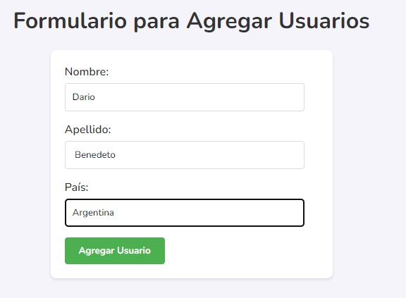

### README.md

# Proyecto para Agregar Usuarios

Aplicación web sencilla para la agregar usuarios, desarrollada utilizando Vite, json-server y JavaScript. La aplicación permite agregar, visualizar y eliminar usuarios. Los usuarios tienen nombres, apellidos y país, y cada uno tiene un ID único para su identificación.

## Descripción

La aplicación consta de un formulario para agregar usuarios y una tabla que muestra la lista de usuarios. Los datos de los usuarios se almacenan en un archivo JSON utilizando json-server como backend.
#### Formulario para Agregar Usuarios

#### Tabla de Usuarios

#### Json Server

### Estructura 

- **index.html**: Archivo HTML principal que contiene la estructura básica de la página, incluyendo el formulario y la tabla.
- **main.js**: Archivo JavaScript que maneja la lógica de la aplicación, incluyendo la interacción con el servidor para leer, crear y eliminar usuarios.
- **db.json**: Archivo JSON para almacenar los datos de los usuarios. Este archivo simula una base de datos y es gestionado por json-server. Cada usuario en db.json tiene una estructura que incluye un ID único, nombre, apellido y país.

### Descripción

1. **Cargar la lista de usuarios al iniciar la página**:
   - Se configura un listener para el evento DOMContentLoaded que llama a la función readUsers.
   - La función readUsers realiza una solicitud GET al servidor para obtener la lista de usuarios y actualiza la tabla con los datos recibidos.

2. **Agregar nuevos usuarios**:
   - Se configura un listener para el evento submit del formulario que llama a la función createUser.
   - La función createUser maneja el envío del formulario, crea un nuevo usuario y envía una solicitud POST al servidor. Luego, recarga la lista de usuarios para mostrar el nuevo usuario.

3. **Eliminar usuarios existentes**:
   - Cada fila de la tabla incluye un botón "Eliminar" que llama a la función deleteUser con el ID del usuario correspondiente.
   - La función deleteUser envía una solicitud DELETE al servidor y recarga la lista de usuarios para reflejar la eliminación.

